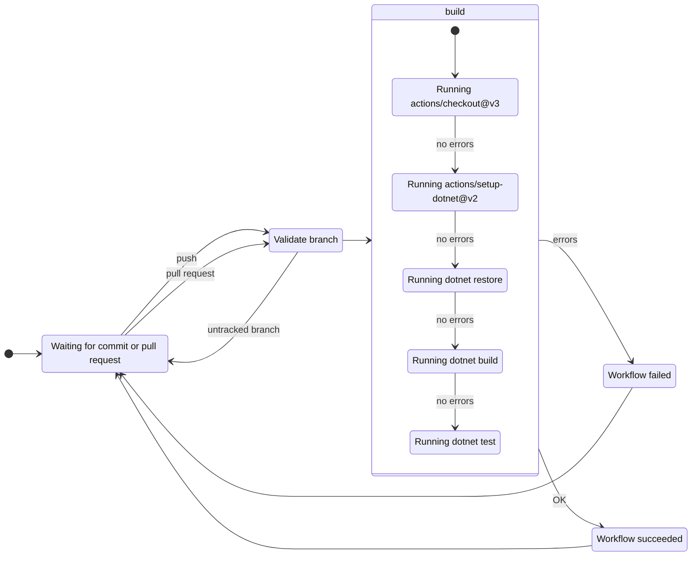

```mermaid
stateDiagram
	direction LR
	state "Waiting for commit or pull request" as wait_for_commit
	state "Validate branch" as validate_branch
	state "Running actions/checkout@v3" as checkout
	state "Running actions/setup-dotnet@v2" as setup_dotnet
	state "Running dotnet restore" as dotnet_restore
	state "Running dotnet build" as dotnet_build
	state "Running dotnet test" as dotnet_test
	state "Workflow failed" as failed
	state "Workflow succeeded" as success
	[*] --> wait_for_commit
	wait_for_commit --> validate_branch: push
	wait_for_commit --> validate_branch: pull request
	validate_branch --> wait_for_commit: untracked branch
	validate_branch --> build
	state build {
		[*] --> checkout
		checkout --> setup_dotnet: no errors
		setup_dotnet --> dotnet_restore: no errors
		dotnet_restore --> dotnet_build: no errors
		dotnet_build --> dotnet_test: no errors
	}
	build --> failed: errors
	build --> success: OK
	failed --> wait_for_commit
	success --> wait_for_commit
```
