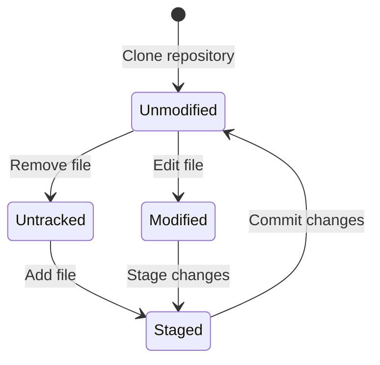

```mermaid
stateDiagram
	direction TB

	[*] --> Unmodified: Clone repository
	Unmodified --> Untracked: Remove file
	Untracked --> Staged: Add file
	Unmodified --> Modified: Edit file
	Modified --> Staged: Stage changes
	Staged --> Unmodified: Commit changes
```
