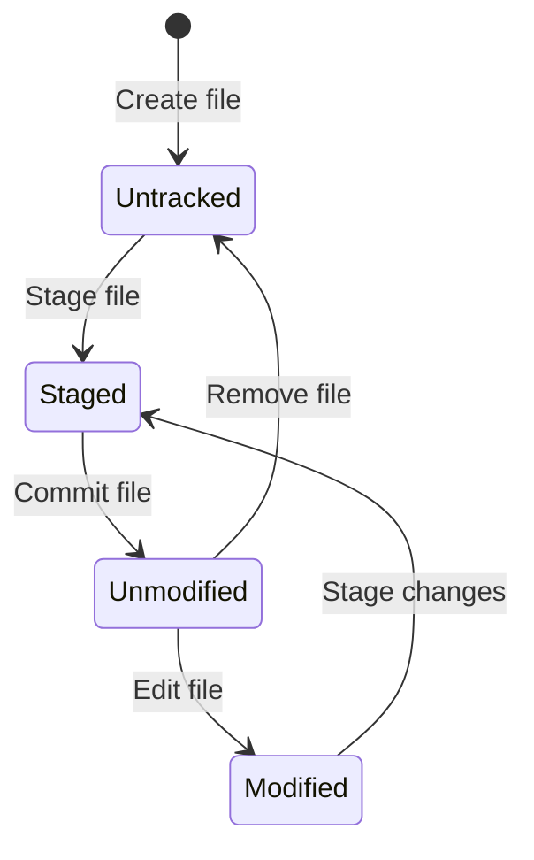

```mermaid
stateDiagram
	direction TB

	[*] --> Untracked: Create file
	Untracked --> Staged: Stage file
	Staged --> Unmodified: Commit file 
	Unmodified --> Modified: Edit file
	Modified --> Staged: Stage changes
	Unmodified --> Untracked: Remove file
```
